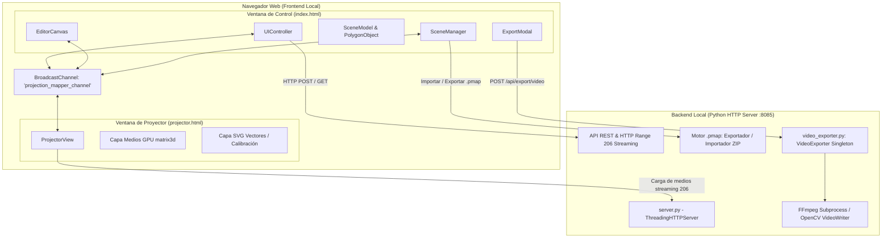

# Documentación Técnica Oficial · Projection Mapper Studio

**Autor:** Jhan By AudacIA  
**Versión de Arquitectura:** 2.7.0  
**Entorno de Ejecución:** Navegador Web Moderno (ES6+) + Backend Python (3.10 - 3.13) + FFmpeg

---

## 1. Visión General y Filosofía de Arquitectura

**Projection Mapper Studio** es un sistema de software diseñado para realizar **Video Mapping (Mapeo Proyectivo)** en tiempo real sin requerir tarjetas gráficas especializadas de alto costo ni licencias propietarias complejas.

### Principios Fundamentales de Diseño
1. **Arquitectura de Doble Ventana Separada:** La interfaz de control (operador) y la salida de proyección corren en procesos de renderizado web independientes. Esto asegura que la ventana del proyector jamás muestre elementos de interfaz, botones, menús contextuales ni cursores del mouse.
2. **Latencia Cero (0 ms) en Sincronización:** En lugar de depender de conexiones WebSocket o peticiones HTTP de sondeo para mover un vértice, la comunicación entre ventanas utiliza la API web nativa `BroadcastChannel`. La sincronización es instantánea, sincrónica a 60-120 FPS y completamente local.
3. **Coordenadas Normalizadas `[0.0 - 1.0]`:** Todas las geometrías, vértices, centros de elipses y curvaturas se calculan en un espacio normalizado independiente de la resolución. Esto permite que una escena diseñada en una pantalla pequeña (ej. 1366×768) se proyecte con precisión milimétrica en un proyector Full HD (1920×1080) o 4K (3840×2160) sin distorsión.
4. **Composición Híbrida GPU/Vectorial:** Los medios visuales (videos e imágenes) se deforman utilizando aceleración por hardware mediante matrices CSS `matrix3d` y recortes `clip-path`, mientras que las guías de calibración se dibujan en una capa vectorial SVG de alta definición.
5. **Autonomía y Portabilidad:** El proyecto está desacoplado de dependencias del sistema operativo y puede ser ejecutado de forma 100% portable desde una memoria USB.

---

## 2. Diagrama de Arquitectura de Alto Nivel



---

## 3. Componentes del Frontend

### 3.1. Sincronización en Tiempo Real (`static/js/sync.js`)
* **Clase:** `MappingSync`
* **Tecnología:** `window.BroadcastChannel('projection_mapper_channel')`
* **Propósito:** Canal de mensajería asíncrono inter-pestañas / inter-ventanas dentro del mismo origen (`localhost:8085`).
* **Mensajes soportados:**
  * `SYNC_FULL_STATE`: Transmite el árbol JSON completo de la escena (usado al arrancar o cargar escenas).
  * `POLYGON_UPDATE`: Transmite el estado de un único polígono modificado (al arrastrar un vértice o mover la figura).
  * `POLYGON_DELETE`: Informa la eliminación de una superficie por su ID único.
  * `DISPLAY_MODE`: Conmuta entre `'calibration'` (guías visibles) y `'show'` (presentación limpia con cursor oculto).
  * `SELECTION_CHANGE`: Informa la superficie seleccionada para destacar su contorno en blanco.
  * `VIDEO_ACTION`: Controla en paralelo la reproducción (`play`, `pause`, `loop`, `mute`, `rate`) en el proyector.
  * `EXPORT_STATE`: Informa al proyector si hay un renderizado en curso para suspender videos y liberar la GPU.
  * `REQUEST_SYNC`: Emitido por la ventana del proyector al abrirse para solicitar el estado actual a la ventana de control.

---

### 3.2. Motor Matemático de Deformación Proyectiva (`static/js/math_warp.js`)
* **Clase:** `MathWarp`
* **Responsabilidad:** Proporcionar las transformaciones algebraicas para mapear texturas cuadriláteras y curvas sobre superficies físicas oblicuas.

#### A. Homografía 2D Proyectiva (Transformación Perspectiva Cuadrilátera)
Para proyectar un medio rectangular de tamaño $W_s \times H_s$ sobre cuatro puntos arbitrarios en el espacio 2D $(x_0, y_0), (x_1, y_1), (x_2, y_2), (x_3, y_3)$, se resuelve el sistema lineal de homografía proyectiva:

$$\begin{pmatrix} x' \\ y' \\ 1 \end{pmatrix} \sim \mathbf{H} \begin{pmatrix} x \\ y \\ 1 \end{pmatrix} = \begin{pmatrix} h_{11} & h_{12} & h_{13} \\ h_{21} & h_{22} & h_{23} \\ h_{31} & h_{32} & 1 \end{pmatrix} \begin{pmatrix} x \\ y \\ 1 \end{pmatrix}$$

1. **Cuadrado Unitario a Cuadrilátero Arbitrario (`getUnitSquareToQuadHomography`):**
   Calcula la matriz $H$ evaluando los deltas de las esquinas $(\Delta x_1, \Delta y_1, \dots)$ para determinar si la transformación es afín pura o contiene componentes perspectivas proyectivas ($h_{31} \neq 0$ o $h_{32} \neq 0$).
2. **Conversión a `matrix3d` de CSS (`getMatrix3D`):**
   El estándar CSS Transform Level 2 define `matrix3d` en orden *column-major* de 16 elementos:
   ```javascript
   matrix3d(
     h11, h21, 0, h31,
     h12, h22, 0, h32,
     0,   0,   1, 0,
     h13, h23, 0, h33
   )
   ```
   Esto permite que el procesador gráfico (GPU) acelere la deformación en tiempo real mediante shaders nativos del navegador, sin pérdida de cuadros.

#### B. Mapeo Curvo y Splines Bézier
* **`getSampledCurvedPolygon(points, edgeCurves, samplesPerEdge = 24)`:**  
  Interpola cada segmento entre los vértices $P_0$ y $P_1$. Si el segmento tiene definido un vector de curvatura Bézier $(cx, cy)$, calcula los puntos intermedios evaluando la curva cuadrática paramétrica:
  $$B(t) = (1-t)^2 P_0 + 2(1-t)t P_c + t^2 P_1, \quad t \in [0, 1]$$
* **`getCurvedSvgPath(points, edgeCurves, width, height)`:**  
  Genera la sintaxis SVG `M ... Q cx cy, x y` para renderizar aristas curvadas directamente en el DOM con suavizado anti-aliasing.
* **`getEllipseBoundary(cx, cy, rx, ry, rotationDeg, samples = 64)`:**  
  Genera el polígono perimetral de elipses y círculos mediante muestreo angular trigonométrico considerando su ángulo de rotación.

---

### 3.3. Modelo de Datos (`static/js/polygon_model.js`)
* **`PolygonObject`:** Representa una superficie individual.
  * `id`: Identificador único (`poly_timestamp_random`).
  * `name`: Nombre descriptivo editable.
  * `type`: `'quad' | 'square' | 'circle' | 'triangle' | 'polygon' | 'occluder' | 'circle_occluder'`.
  * `points`: Array de coordenadas normalizadas `[[x0, y0], [x1, y1], ...]`.
  * `edgeCurves`: Objeto asociativo `{ "0-1": [cx, cy], ... }` con los puntos de control Bézier por arista.
  * `color`: Color hexadecimal para relleno o guía.
  * `visible`: Booleano para visibilidad en el proyector.
  * `locked`: Booleano para bloquear selección y edición accidental.
  * `media`: Objeto con propiedades del contenido asignado (`type`, `src`, `playing`, `loop`, `muted`, `playbackRate`, `opacity`).
* **`SceneModel`:** Contenedor de la escena activa.
  * Administra la lista de polígonos ordenados por Z-Index (capas).
  * Implementa la pila de **Deshacer/Rehacer (Undo/Redo)** con límite de 50 estados.
  * Administra el autoguardado en `localStorage` (`projection_mapper_autosave`).

---

### 3.4. Motor del Proyector (`static/js/projector_view.js`)
* **Doble Capa de Salida:**
  1. `#projector-media-viewport`: Elemento `div` fijado estrictamente en `1920 × 1080 px` con `overflow: visible;`. En cada redimensionamiento de ventana, se aplica una escala CSS uniforme `scale(innerWidth / 1920, innerHeight / 1080)` desde el origen `(0, 0)`. Esto garantiza que los videos y texturas coincidan al 100% con la geometría sin sufrir recortes arbitrarios por límites de pantalla.
  2. `#projector-svg`: Elemento vectorial con `viewBox="0 0 1920 1080"` superpuesto con `preserveAspectRatio="none"`.
* **Modos de Salida:**
  * **Calibración:** Dibuja las líneas de alambre (wireframes), puntos de esquina interactivos y números identificadores. El cursor es visible.
  * **Presentación (Show):** Oculta por completo la capa vectorial de calibración y aplica la clase CSS `cursor: none !important;` en todo el documento.
* **Protección de GPU:** Al recibir el evento `EXPORT_STATE (isRunning = true)`, pausa automáticamente todos los elementos `<video>` del proyector para evitar la contención de memoria VRAM mientras el codificador de video opera a máxima velocidad.

---

## 4. Componentes del Backend

### 4.1. Servidor HTTP Multihilo (`server.py`)
* Implementado sobre `http.server.ThreadingHTTPServer`, permitiendo atender múltiples conexiones concurrentes sin bloquear la interfaz.
* **Streaming Multimedia con Soporte HTTP 206 (Partial Content):**
  * `handle_media_stream()`: Interpreta encabezados `Range: bytes=start-end`.
  * Crucial para que los videos `<video>` en el navegador puedan realizar saltos de tiempo (seeking) inmediatos, reproducción en bucle continuo y pre-carga eficiente de metadatos sin descargar todo el archivo en memoria.
* **Endpoints de la API REST:**
  * `GET /api/media`: Lista imágenes y videos presentes en la carpeta `media/`.
  * `POST /api/media/upload`: Recepción de archivos subidos por Drag & Drop o explorador.
  * `GET /api/scenes` & `POST /api/scenes`: Listado y almacenamiento de escenas JSON.
  * `GET /api/exports`: Lista los videos pre-mapeados renderizados en `media/exports/`.
  * `DELETE /api/exports/<filename>`: Eliminación física de un video renderizado.
  * `POST /api/system/shutdown`: Cierre controlado del proceso Python y liberación inmediata del socket en el puerto `8085`.

---

### 4.2. Especificación del Paquete Autónomo `.pmap`
Un archivo `.pmap` (*Projection Map Package*) es un contenedor comprimido ZIP estándar estructurado de la siguiente forma:

```text
paquete_evento.pmap (ZIP)
├── project.json              # Datos geométricos, curvas, calibración y metadatos
└── media/                    # Archivos reales requeridos por la escena
    ├── videos/
    │   └── clip_fachada.mp4
    └── images/
        └── textura_columna.png
```

#### Exportación (`handle_export_project`):
1. Inspecciona la escena activa.
2. Identifica todos los archivos locales referenciados en `poly.media.src`.
3. Empaqueta los archivos físicos dentro del ZIP en memoria (`io.BytesIO`) y reescribe las rutas internas a formato relativo `media/videos/...`.
4. Envía el flujo binario con cabecera `Content-Type: application/octet-stream` para descarga directa en el navegador.

#### Importación (`handle_import_project`):
1. Lee el flujo de bytes entrante.
2. Valida la firma del archivo (`PK\x03\x04`).
3. **Seguridad contra Zip Slip:** Valida que ninguna ruta relativa intente escribir fuera del directorio raíz (`BASE_DIR`) mediante nombres con `../`.
4. Extrae los medios a `media/videos/` y `media/images/`. Si un archivo ya existe con diferente tamaño, le asigna un sufijo incremental seguro para no sobrescribir material previo.
5. Re-enlaza las URLs de los polígonos a las rutas locales del nuevo equipo y entrega la escena lista al frontend.

---

### 4.3. Motor de Renderizado de Video Pre-Mapeado (`video_exporter.py`)
* **Clase:** `VideoExporter` (Patrón Singleton).
* **Flujo de Ejecución:**
  1. Se instancia en un hilo de ejecución secundario (`threading.Thread`) para no bloquear el servidor web.
  2. Determina la duración del bucle (detectada automáticamente por la duración del video más largo o configurada por el usuario).
  3. **Matriz de Aceleración por Hardware:**
     Evalúa mediante `ffmpeg -encoders` la disponibilidad de aceleración GPU en el equipo:
     * **NVIDIA:** `h264_nvenc`
     * **AMD:** `h264_amf`
     * **Intel:** `h264_qsv`
     * **Windows:** `h264_mf` (Media Foundation)
     * **Fallback CPU:** `libx264` (Preset `fast`, CRF 19).
  4. **Tubería de Renderizado Frame-a-Frame:**
     * Inicializa un subproceso de FFmpeg recibiendo video crudo vía `stdin` (`-f rawvideo -pix_fmt bgr24`).
     * Itera $N$ fotogramas calculando el tiempo temporal exacto $t = \frac{\text{frame}}{\text{fps}}$.
     * Construye un lienzo NumPy de fondo negro `(H, W, 3)`.
     * Para cada superficie visible (en orden Z-Index):
       * Extrae el fotograma correspondiente del video o imagen utilizando `cv2.VideoCapture` con posicionamiento temporal `(t * rate * vid_fps) % total_frames`.
       * **Deformación Cuadrilátera:** Calcula la homografía 3×3 con `cv2.getPerspectiveTransform` y deforma con `cv2.warpPerspective`.
       * **Deformación Curva / Poligonal:** Escala el contenido a la caja contenedora y aplica una máscara poligonal con `cv2.fillPoly`.
       * **Máscaras de Oclusión:** Dibuja negro puro sobre el lienzo.
       * Compone con mezcla alfa (`cv2.addWeighted`) según la opacidad configurada.
     * Envía el buffer de bytes del lienzo por `stdin.write()`.
  5. **Cancelación Atómica y Limpieza Segura:**
     * Si el usuario cancela (`cancel()`), el bucle se interrumpe de inmediato.
     * Se cierran los pipes y se finaliza el proceso de FFmpeg.
     * **Eliminación Garantizada:** El archivo parcial generado se elimina inmediatamente del disco (`output_path.unlink()`). Jamás quedan archivos truncados o corruptos en `media/exports/`.

---

## 5. Tabla de Eventos del Protocolo de Sincronización

| Nombre de Evento | Origen | Carga Útil (Payload) | Descripción |
|---|---|---|---|
| `SYNC_FULL_STATE` | Control | `{ name, polygons, displayMode }` | Envío masivo del estado completo de la escena |
| `REQUEST_SYNC` | Proyector | `{}` | Petición de estado al abrirse la ventana del proyector |
| `POLYGON_UPDATE` | Control | `polyData (JSON)` | Actualización de vértices, color o medio de un polígono |
| `POLYGON_DELETE` | Control | `{ id: string }` | Notificación de eliminación de superficie |
| `DISPLAY_MODE` | Ambos | `{ mode: 'calibration' \| 'show' }` | Alternancia entre modo calibración y presentación |
| `SELECTION_CHANGE` | Control | `{ id: string \| null }` | Resaltado del contorno de la figura activa |
| `VIDEO_ACTION` | Control | `{ polyId, action, value }` | Comando de reproducción de video (play, pause, etc.) |
| `EXPORT_STATE` | Control | `{ isRunning, progress, message }` | Notificación de suspensión de recursos por renderizado |

---

## 6. Guía de Extensión para Desarrolladores

### Añadir una Nueva Figura Geométrica
1. Definir la función creadora en `static/js/polygon_model.js` dentro de la clase `PolygonObject` (ej. `createDefaultStar()`).
2. Retornar los puntos en coordenadas relativas centradas `[0.0 - 1.0]`.
3. Agregar el botón correspondiente en el menú desplegable de `static/index.html`.
4. Enlazar el evento en `bindEvents()` de `static/js/ui_controller.js` invocando `this.addSurfaceAndSelect(PolygonObject.createDefaultStar())`.

### Modificar Opciones del Codificador de Video
* Dirigirse a la función `get_best_encoder_info()` en `video_exporter.py`.
* Los parámetros de calidad, tasa de bits (bitrate) o perfiles de codificación GPU se definen en el diccionario `extra_flags` de cada codec.

---

## 7. Control de Calidad y Mantenimiento

* **Verificación de Sintaxis Frontend:**
  ```bash
  node -c static/js/ui_controller.js static/js/projector_view.js static/js/scene_manager.js static/js/export_modal.js
  ```
* **Verificación de Endpoints y Exportación:**
  ```bash
  python .gemini/antigravity-cli/brain/.../scratch/verify_fixes.py
  ```
* **Sincronización con el Paquete Portable:**
  Cualquier cambio realizado en los archivos del directorio `static/`, `server.py` o `video_exporter.py` debe copiarse a la carpeta `ProjectionMapper-Portable/` para preservar la paridad total.
